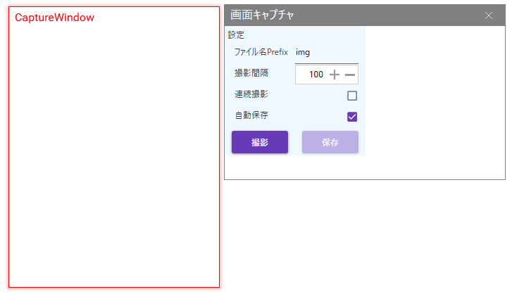
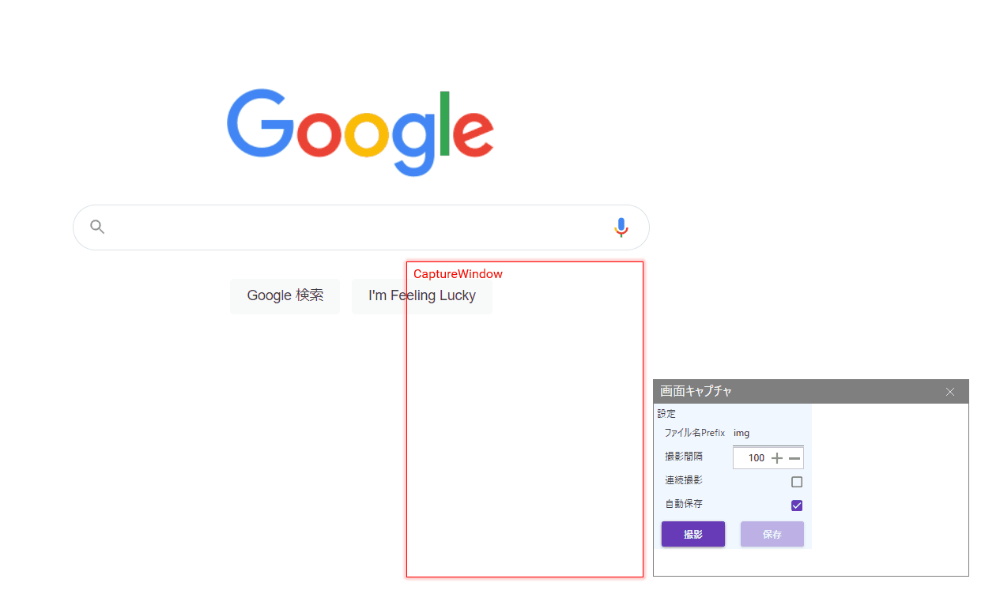

# screen-capture

CaptureWindowで指定した範囲の画面キャプチャを取得・保存するアプリケーションです。

## AppWindow

## DEMO

## Features

連続撮影した画像を機械学習の学習データとして利用できる想定。

## Usage

1. CaptureWindowでキャプチャを取りたい範囲を指定する。
2. 撮影ボタンを押下する。

- 設定
　ファイル名Prefix：ファイル名のPrefixを指定する。
　連続撮影：チェックした場合は、指定した間隔で連続撮影を行う。
　自動保存：自動保存するかの設定を行う。

## 今後の計画

- プロセスIDを指定した特定のアプリケーション全体のキャプチャ
- ショートカットキーによるキャプチャ
- プレビュー画面の改善
- 別のアプリケーションへの機能提供
  画像判定を行うシステムへのキャプチャ機能の流用
